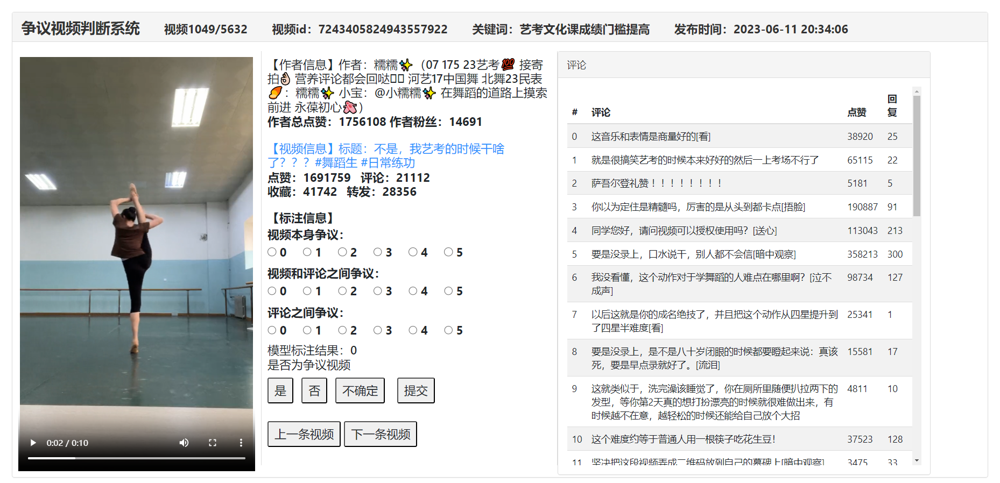
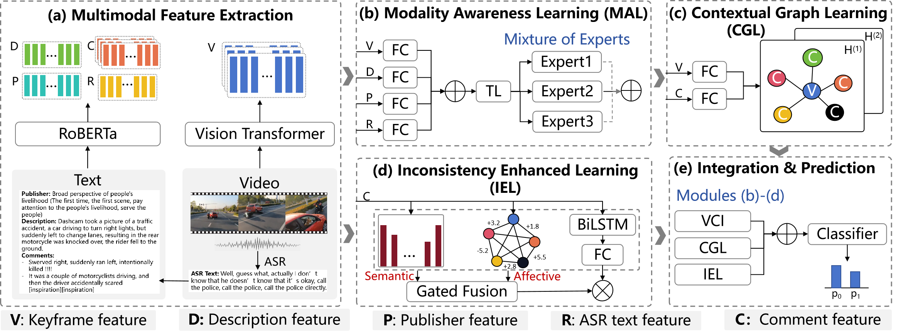

<h1 align="center"> <a href=>A Chinese Multimodal Social Video Dataset <br/> for Controversy Detection</a></h2>


## :sparkles: Keypoints
* Social video platforms are significant for information dissemination and public discussions, often leading to controversies.
* Current controversy detection approaches mainly focus on textual features, leading to three concerns:
  - Underutilization of visual information on social media.
  - Ineffectiveness with incomplete or absent textual information.
  - Inadequate existing datasets for comprehensive multimodal resources on social media.
* Contributions
  - A large-scale Multimodal Controversial Dataset (MMCD) in Chinese is constructed to address these challenges.
  - A novel framework named Multi-view Controversy Detection (MVCD) is proposed to model controversies from multiple perspectives.
  - Extensive experiments using state-of-the-art models on the MMCD demonstrate the effectiveness and potential impact of MVCD.

## Dataset

We have included a [sample metadata file](data/metadata_sample.json) in this repository for preview purposes. This sample contains a random selection of 50 videos from the complete dataset. You may download the full dataset from [here](https://pan.quark.cn/s/379c4b020edd) (password: 4EB2).

<p align="center">
    
    
</p>

<!-- Annotation system:

<p align="center">
    
</p> -->

## Approach
<p align="center">
    
</p>


## :rocket: Getting Started
Dependencies
- Python: 3.10.13
- Pytorch: 2.2.1+cu121

Install the dependencies using pip
```bash
pip install -r requirements.txt
```
Start training and testing!
```bash
python main.py
```

## :book: Citation
If you find our paper and code useful in your research, please consider giving a star :star: and citation :book:.

```BibTeX
@inproceedings{wang2023rtq,
  author       = {Tianjiao Xu and
                  Aoxuan Chen and
                  Yuxi Zhao and
                  Jinfei, Gao and
                  Tian Gan},
  title        = {A Chinese Multimodal Social Video Dataset for Controversy Detection},
  booktitle    = {Proceedings of the {ACM} International Conference on Multimedia},
  publisher    = {{ACM}},
  year         = {2024},
}
```

## License
Code released under the [Apache-2.0](LICENSE) License. Dataset released under the [CC BY-NC-SA 4.0](https://creativecommons.org/licenses/by-sa/4.0/).

## Ethical Statement
We gather publicly available video information to investigate its controversial characteristics. In addition to the annotated data, we provide only the links for video downloads. As for publishers' profiles, we delete private information and only provide embeddings of them. It is explicitly mentioned in our paper how the collected data is utilized and for what purposes. It is important to note that our data is intended solely for academic research and should not be employed outside the scope of academic research contexts.


