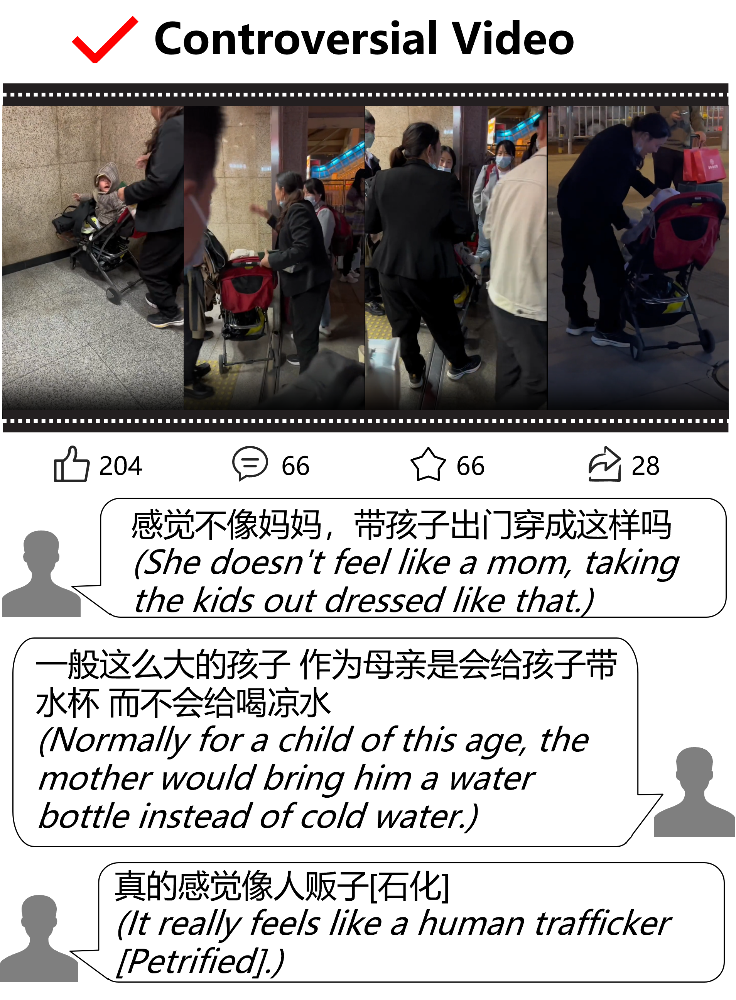
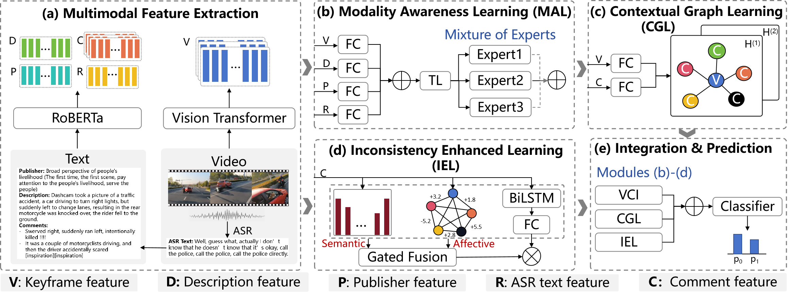

<a id="top"></a>

<div align="center">

# 🎬 A Chinese Multimodal Social Video Dataset for Controversy Detection

<p>
  <b>Tianjiao Xu</b><sup>1</sup> &nbsp;
  <b>Aoxuan Chen</b><sup>1</sup> &nbsp;
  <b>Yuxi Zhao</b><sup>1</sup> &nbsp;
  <b>Jinfei Gao</b><sup>1</sup> &nbsp;
  <b>Tian Gan</b><sup>1</sup><sup>*</sup>
</p>

<p>
  <sup>1</sup>Shandong University
</p>

<p>
  <sup>*</sup> Corresponding author
</p>

<p>
  <a href="https://dl.acm.org/doi/10.1145/3664647.3681630">
    
  </a>
</p>

<p>
  <b>A large-scale Chinese multimodal social video dataset (MMCD) with rich social context for controversy detection, along with a multi-view modeling framework.</b>
</p>

</div>

## :sparkles: Keypoints
* Social video platforms are significant for information dissemination and public discussions, often leading to controversies.
* Current controversy detection approaches mainly focus on textual features, leading to three concerns:
  - Underutilization of visual information on social media.
  - Ineffectiveness with incomplete or absent textual information.
  - Inadequate existing datasets for comprehensive multimodal resources on social media.
* Contributions
  - A large-scale Multimodal Controversial Dataset (MMCD) in Chinese is constructed to address these challenges.
  - A novel framework named Multi-view Controversy Detection (MVCD) is proposed to model controversies from multiple perspectives.
  - Extensive experiments using state-of-the-art models on the MMCD demonstrate the effectiveness and potential impact of MVCD.

## :mag: Dataset

We uploaded the main data files in the dataset folder, and you could also directly download the dataset features from [here](https://pan.quark.cn/s/59adf3876d39) (password: kJa2).

<p align="center">
    
    
</p>

## :memo: Approach
<p align="center">
    
</p>


## :rocket: Getting Started
Dependencies
- Python: 3.10.13
- Pytorch: 2.2.1+cu121

Install the dependencies using pip
```bash
pip install -r requirements.txt
```
Start training and testing!
```bash
python main.py
```

## :book: Citation
If you find our paper and code useful in your research, please consider giving a star :star: and citation :book:.

```BibTeX
@inproceedings{mmcd,
  author       = {Xu, Tianjiao and Chen, Aoxuan and Zhao, Yuxi and Gao, Jinfei and Gan, Tian},
  title        = {A Chinese Multimodal Social Video Dataset for Controversy Detection},
  booktitle    = {Proceedings of the {ACM} International Conference on Multimedia},
  publisher    = {{ACM}},
  page         = {2898--2907},
  year         = {2024},
}
```

## :page_facing_up: License
Code released under the [Apache-2.0](LICENSE) License. Dataset released under the [CC BY-NC-SA 4.0](https://creativecommons.org/licenses/by-sa/4.0/).

## :busts_in_silhouette: Ethical Statement
We gather publicly available video information to investigate its controversial characteristics. In addition to the annotated data, we provide only the links for video downloads. As for publishers' profiles, we delete private information and only provide embeddings of them. It is explicitly mentioned in our paper how the collected data is utilized and for what purposes. It is important to note that our data is intended solely for academic research and should not be employed outside the scope of academic research contexts.


