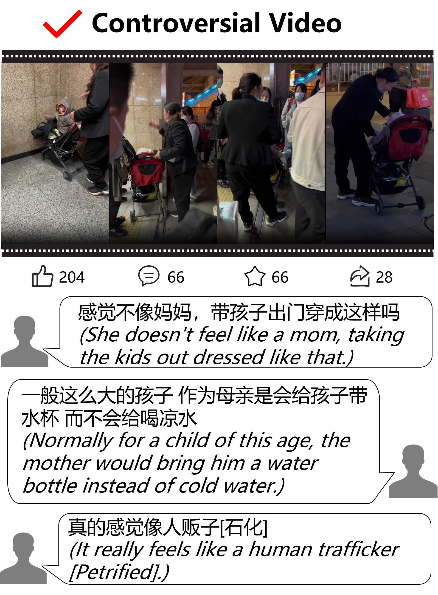
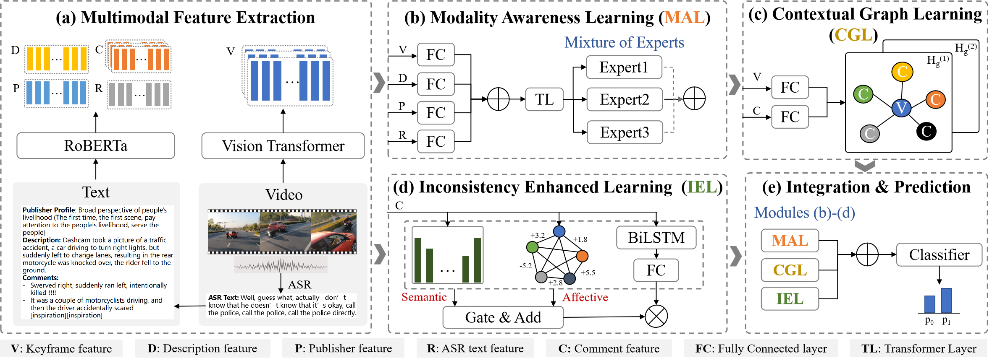

# MM_Controversy_Detection

Official repository for ["***A Chinese Multimodal Social Video Dataset for Controversy Detection***"]. 

## Dataset

We have included a sample metadata file, [metadata_sample.json](data/metadata_sample.json), in this repository for preview purposes. This sample contains a random selection of 50 videos from the complete dataset. 

<p align="center">
    
    
</p>

<!-- Annotation system:

<p align="center">
    
</p> -->

## Approach
<p align="center">
    
</p>

## Getting Started

### Dependencies

Install the dependencies using pip

```
pip install -r requirements.txt
```
### Dataset

You may download the [dataset](https://pan.quark.cn/s/379c4b020edd), with password "4EB2".

### Citation
```
@inproceedings{mmcd, 
title={A Chinese Multimodal Social Video Dataset for Controversy Detection}, 
author={Tianjiao, Xu and Aoxuan, Chen and Yuxi, Zhao and Jinfei, Gao and Tian, Gan}, 
booktitle={Proceedings of {ACM} International Conference on Multimedia},
year={2024}, 
organization={ACM MM} 
} 
```

## License
Code released under the [Apache-2.0](LICENSE) License. Dataset released under the [CC BY-NC-SA 4.0](https://creativecommons.org/licenses/by-sa/4.0/).

## Ethical Statement
We gather publicly available video information to investigate its controversial characteristics. In addition to the annotated data, we provide only the links for video downloads. As for publisher's profile, we delete privacy information and only provide embedding of them. It is explicitly mentioned in our paper how the collected data is utilized and for what purposes. It is important to note that our data is intended solely for academic research and should not be employed outside the scope of academic research contexts.
